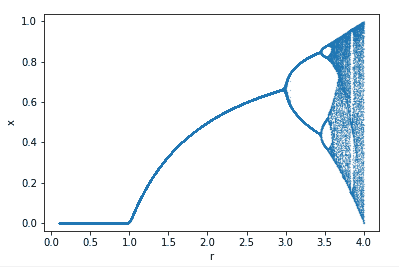
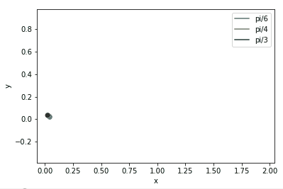
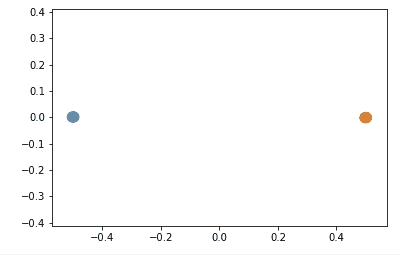
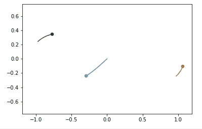
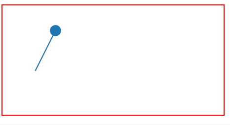

# PHYS:150 Introduction to Programming for Physics: A Freshmen Class

Most of the lecture notes are written in Jupyter Notebooks and are fully interactive on 

Try them out!

## Lectures

- lecture 1: introduction to programming in physics
- lecture 2: demonstrations and software installing
- [lecture 3: markdown and LaTeX](https://nbviewer.org/github/slxuphys/phys150/blob/main/lecture/lecture%203%20markdown.ipynb)
- [lecture 4&5: scalar variables](https://nbviewer.org/github/slxuphys/phys150/blob/main/lecture/lecture%204%20%26%205%20scalar%20variable.ipynb)
- [lecture 6&7&8: containers](https://nbviewer.org/github/slxuphys/phys150/blob/main/lecture/lecture%206%267%268%20container.ipynb)
- [lecture 9: branching](https://nbviewer.org/github/slxuphys/phys150/blob/main/lecture/lecture%209%20branching.ipynb)
- [lecture 10&11: loop](https://nbviewer.org/github/slxuphys/phys150/blob/main/lecture/lecture%2010%2611%20loop.ipynb)
- [lecture 12&13&15: motion in a straightline](https://nbviewer.org/github/slxuphys/phys150/blob/main/lecture/lecture%2012%2013%2015%20motion%20in%20straight%20line.ipynb) 
- lecture 14: game party demonstration 👽⚔️🐉
- [lecture 16&17: function](https://nbviewer.org/github/slxuphys/phys150/blob/main/lecture/lecture%2016%2017%20function.ipynb)
- [lecture 18: class](https://nbviewer.org/github/slxuphys/phys150/blob/main/lecture/lecture%2018%20Class.ipynb)
- [lecture 19: modules](https://nbviewer.org/github/slxuphys/phys150/blob/main/lecture/lecture%2019%20Modules.ipynb)
- [lecture 20&21: plotting and animation](https://nbviewer.org/github/slxuphys/phys150/blob/main/lecture/lecture%2020%20matplotlib.ipynb)
- [lecture 22&23: planetary motion](https://nbviewer.org/github/slxuphys/phys150/blob/main/lecture/lecture%2021%20Planetary%20Motion%20and%20three%20body%20problem.ipynb)
- [lecture 24: optimization and equation solving](https://nbviewer.org/github/slxuphys/phys150/blob/main/lecture/lecture%2023%20optimization%20and%20solving%20equation.ipynb)
- [lecture 25: simple iteration and complex behavior](https://nbviewer.org/github/slxuphys/phys150/blob/main/lecture/lecture%2024%20simple%20iteration%20and%20complex%20phenomena.ipynb)

## Gallary

After taking the course, you can aslo make these cool animation as well!

